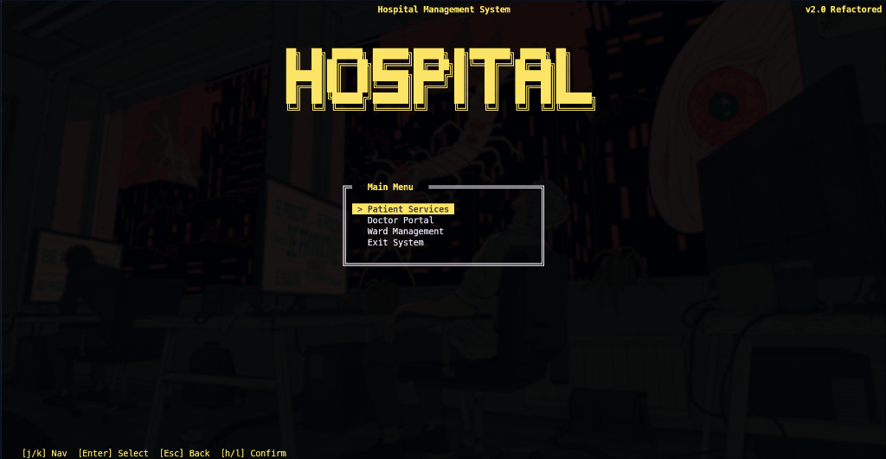
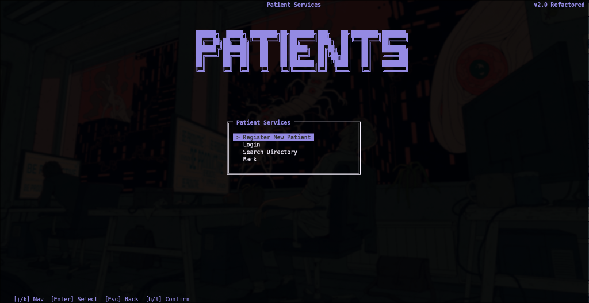
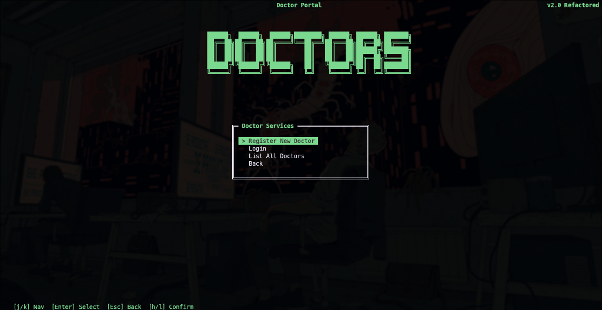
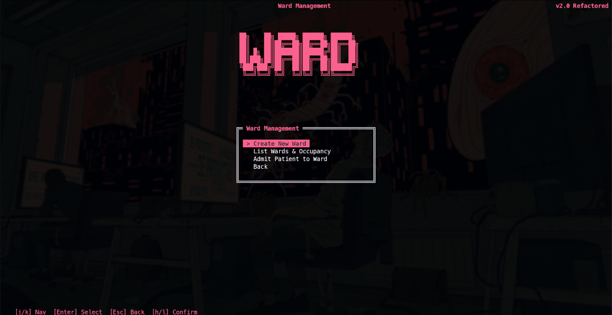
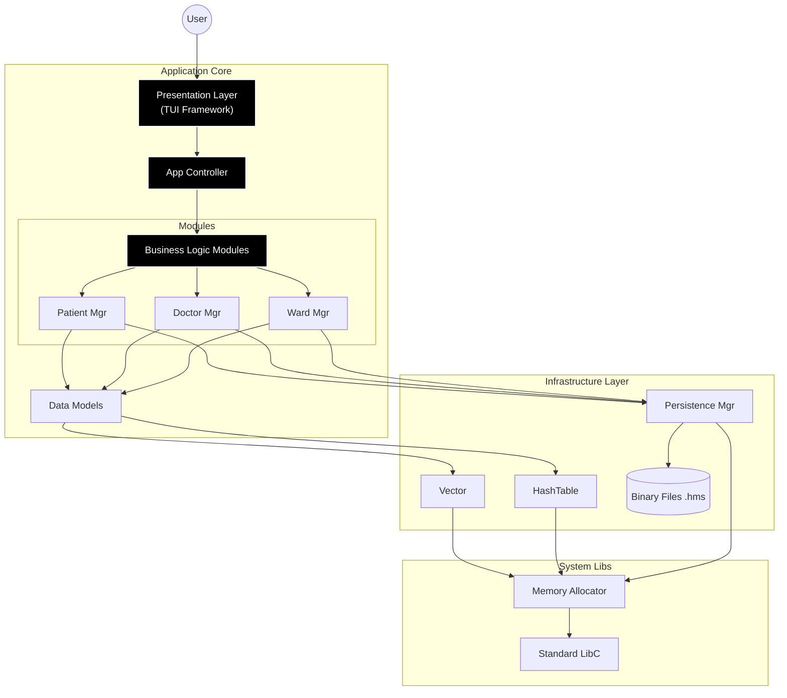

# 🏥 Hospital Management System (HMS)

A modular C application for hospital management, featuring a ncurses-based TUI (Text User Interface) with custom memory management, data persistence, and distinct visual themes.

## Gallery

|             Main Menu              |           Patient Services           |
| :--------------------------------: | :----------------------------------: |
|   |  |
|         **Doctor Portal**          |         **Ward Management**          |
|  |          |

## Features

A terminal-based system engineered for efficiency and reliability. Capable of managing complex patient, doctor, and ward data with persistent binary storage and a responsive localized interface.

---

## ⚡ Technology Stack

Built on the **C11 standard**, this project implements a custom core library to deliver features typically found in higher-level languages, maintaining the raw performance of C.

### 🧠 Core Engine

- **Custom Memory Manager**: Wraps standard allocations (`malloc`/`free`) with a tracking layer to enforce memory safety and provide detailed leak detection reports on shutdown.
- **Generic Data Structures**:
  - `Vector`: A dynamic array implementation using `void*` type erasure for storing any data type.
  - `HashTable`: A separate-chaining hash map for O(1) identifier lookups.
- **Binary Persistence**: Custom serialization protocol (`.hms` format) that directly marshals dynamic structures to disk for optimal load/save performance.

### 🖥️ UI Framework (TUI)

- **ncurses Integration**: Provides a rich terminal interface with window management.
- **Widget System**: Custom implementations for:
  - **Forms**: Field-based input with type validation (Int, Float, Password).
  - **Menus**: Keyboard-navigable selection interfaces.
  - **Tables**: Scrollable, multi-column data grids.

---

## 🏗️ Architecture Overview

The system follows a strict **Layered Architecture** to separate concerns between the User Interface, Business Logic, and Data Access layers.



---

## 🚀 Getting Started

### 🐧 Linux Setup

**Ubuntu / Debian**

```bash
sudo apt update
sudo apt install build-essential libncurses-dev
```

**Arch Linux**

```bash
sudo pacman -S base-devel ncurses
```

### 🪟 Windows Setup (WSL)

We recommend **Windows Subsystem for Linux (WSL)** for the native POSIX experience.

1.  **Install WSL**: Run `wsl --install` in PowerShell as Administrator.
2.  **Open Ubuntu**: Launch your WSL terminal.
3.  **Install Dependencies**: Follow the Linux instructions above.

---

## 🛠️ Build & Run

1.  **Clone & Build**

    ```bash
    git clone https://github.com/lxrdxe7o/shiro-nekoo-115.git
    cd shiro-nekoo-115
    make
    ```

2.  **Launch**
    ```bash
    ./hms
    ```

---

## 📂 Project Structure

```
.
├── include/        # 📐 Interface Definitions
│   ├── tui.h       # UI Framework headers
│   ├── vector.h    # Core container headers
│   └── ...
├── src/            # 🧱 Implementation
│   ├── main.c      # Entry point
│   ├── database.c  # Binary serializers
│   └── ...
├── data/           # 💾 Storage (Auto-generated)
└── Makefile        # ⚙️ Build System
```

---

## 📜 License

This project is licensed under the MIT License - see the LICENSE file for details.


